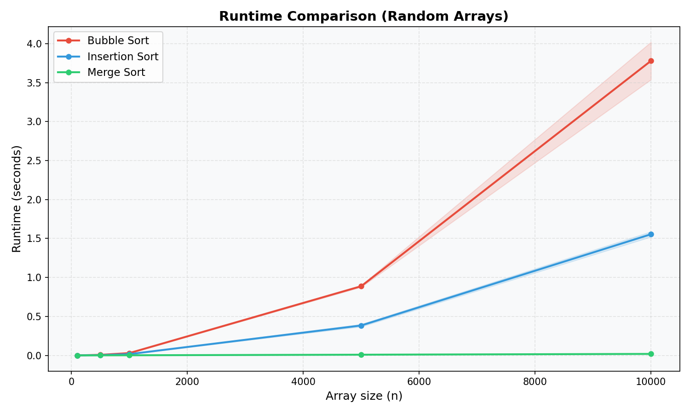
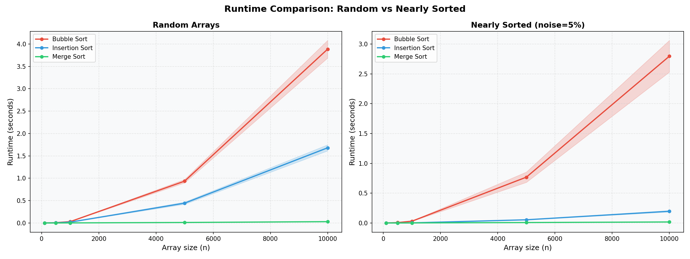

# Sorting_Assignment

## Students Name
Leon Shumil Kelrikh & Dvir solomon

## Selected Algorithms
All five algorithms were implemented. For the experiments, algorithms 1 (Bubble Sort), 3 (Insertion Sort), and 4 (Merge Sort) were selected.

1. **Bubble Sort** (ID: 1) – O(n²) — repeatedly swaps adjacent out-of-order elements until the array is sorted.
2. **Selection Sort** (ID: 2) – O(n²) — finds the minimum element in the unsorted portion and places it at the front.
3. **Insertion Sort** (ID: 3) – O(n²) average, O(n) best case — builds a sorted sub-array one element at a time by inserting each element into its correct position.
4. **Merge Sort** (ID: 4) – O(n log n) — divide-and-conquer algorithm that splits, recursively sorts, and merges.
5. **Quick Sort** (ID: 5) – O(n log n) average — divide-and-conquer using a median-of-five pivot to partition the array.

---

## How to Run

Install dependencies (one time only):
```bash
pip3 install numpy matplotlib --break-system-packages
```

### CLI Usage (Part D)

```bash
python3 run_experiments.py -a <IDs> -s <sizes> -e <experiment> -r <repetitions>
```

| Flag | Description |
|------|-------------|
| `-a` | Algorithm IDs (space-separated): `1`=Bubble, `2`=Selection, `3`=Insertion, `4`=Merge, `5`=Quick |
| `-s` | Array sizes to test (space-separated) |
| `-e` | `0` = Random arrays (result1.png) · `1` = Nearly sorted 5% noise (result2.png) · `2` = Nearly sorted 20% noise (result2.png) |
| `-r` | Number of repetitions per size |

### Example Commands

```bash
# Part B – Random arrays
python3 run_experiments.py -a 1 3 4 -s 100 500 1000 5000 10000 -e 0 -r 5

# Part C – Nearly sorted, 5% noise
python3 run_experiments.py -a 1 3 4 -s 100 500 1000 5000 10000 -e 1 -r 5

# Part C – Nearly sorted, 20% noise
python3 run_experiments.py -a 1 3 4 -s 100 500 1000 5000 10000 -e 2 -r 5
```

> **Note:** Bubble Sort and Insertion Sort are O(n²) and become impractical at very large input sizes (e.g. 10⁶ elements). Following the course guidelines, they are run only on the shared smaller range (up to 10,000) and compared with Merge Sort there. Algorithms are automatically skipped above 20,000 elements to avoid excessive runtime.

---

## Part B – Random Arrays



### Explanation
For raw numbers, see `etc/results_in_text.txt`.

The plot clearly shows the difference between O(n²) and O(n log n) algorithms on random input:

**Bubble Sort** is the slowest. It takes ~3.53s at n=10,000. Its runtime grows quadratically — going from n=1,000 (~0.033s) to n=10,000 (~3.53s) is roughly a 107× increase for a 10× increase in size, consistent with O(n²).

**Insertion Sort** is also O(n²) but about 2.3× faster than Bubble Sort in practice (~1.54s at n=10,000 vs ~3.53s). It performs fewer comparisons and writes per pass, but still cannot scale to large inputs.

**Merge Sort** is dramatically faster, following an O(n log n) growth curve. At n=10,000 it finishes in just ~0.018s — nearly 200× faster than Bubble Sort at the same size. Its runtime grows very gently even as array size increases.

The shaded bands show one standard deviation across repetitions. Merge Sort has a very tight band, indicating stable and predictable performance. Bubble Sort shows more variance at large sizes due to its sensitivity to element order.

---

## Part C – Nearly Sorted Arrays (5% noise)



### Explanation – Did runtimes change vs. random input?

The plot above shows two side-by-side panels: random arrays (left) vs. nearly sorted arrays with 5% noise (right). This makes the difference in behaviour immediately visible across all three algorithms.

On nearly sorted arrays (only 5% of elements are randomly swapped), the runtimes changed noticeably for two of the three algorithms. Comparison is at n=10,000:

**Insertion Sort** improves dramatically on nearly sorted input. Because most elements are already close to their correct position, the inner while-loop runs very few iterations. This is Insertion Sort's adaptive behaviour: its effective complexity becomes O(n·k) where k is the average displacement of each element — much better than O(n²) on random data.

**Bubble Sort** also improves somewhat on nearly sorted input, but the gain is limited. It still scans the full array in every pass even when very few swaps are needed, which restricts how much it benefits from partial order.

**Merge Sort** is essentially unchanged between the two panels. It divides and merges every element regardless of input order, so partial sorting provides no benefit. Its O(n log n) runtime is consistent across all input types. 

**Key takeaway:** For nearly sorted data, Insertion Sort is the standout — its adaptive nature makes it competitive with Merge Sort at moderate sizes. Bubble Sort gains some benefit but not nearly as much. Merge Sort is input-agnostic and remains reliably fast regardless of how sorted the data is.
